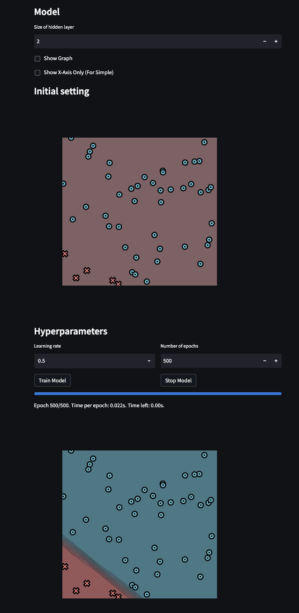
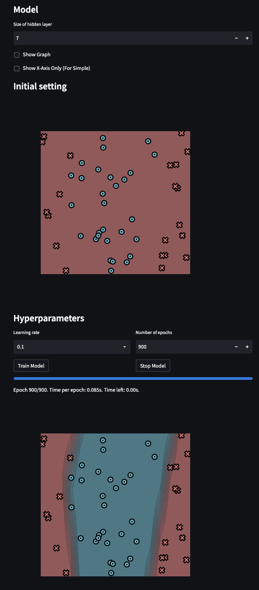
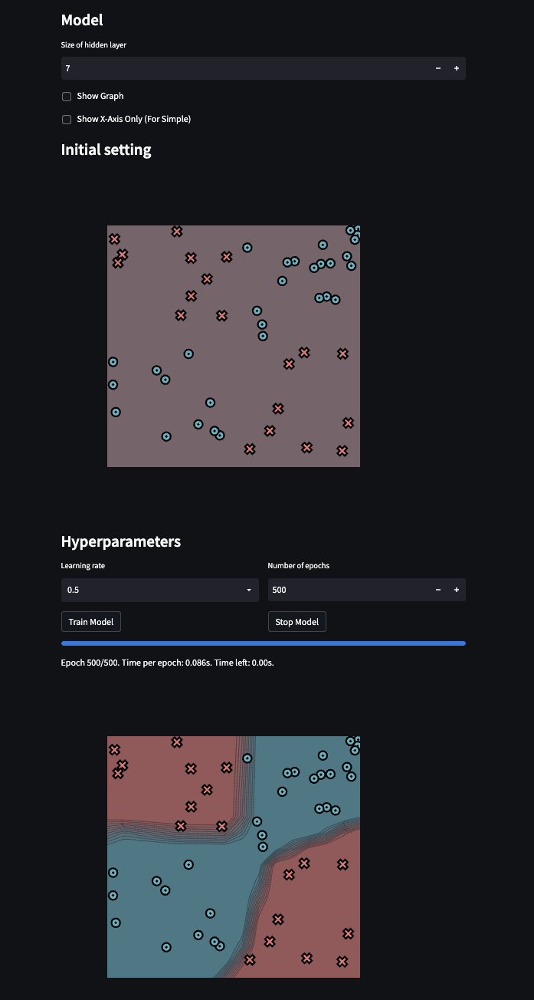

[](https://classroom.github.com/a/YFgwt0yY)
# MiniTorch Module 2


* Docs: https://minitorch.github.io/

* Overview: https://minitorch.github.io/module2/module2/

This assignment requires the following files from the previous assignments. You can get these by running

```bash
python sync_previous_module.py previous-module-dir current-module-dir
```

The files that will be synced are:

        minitorch/operators.py minitorch/module.py minitorch/autodiff.py minitorch/scalar.py minitorch/scalar_functions.py minitorch/module.py project/run_manual.py project/run_scalar.py project/datasets.py

# Simple


Epoch: 0/500, loss: 0, correct: 0
Epoch: 10/500, loss: 14.644377199580589, correct: 45
Epoch: 20/500, loss: 13.864635221291012, correct: 45
Epoch: 30/500, loss: 12.95276871764513, correct: 45
Epoch: 40/500, loss: 11.800810516626944, correct: 45
Epoch: 50/500, loss: 10.28791630483889, correct: 45
Epoch: 60/500, loss: 8.379245931394882, correct: 45
Epoch: 70/500, loss: 6.610680266333469, correct: 46
Epoch: 80/500, loss: 5.4285974876396725, correct: 48
Epoch: 90/500, loss: 4.698455380795792, correct: 48
Epoch: 100/500, loss: 4.164990411023601, correct: 48
Epoch: 110/500, loss: 3.724296683130251, correct: 50
Epoch: 120/500, loss: 3.3499628200358025, correct: 50
Epoch: 130/500, loss: 3.0337027277881243, correct: 50
Epoch: 140/500, loss: 2.7675340608545778, correct: 50
Epoch: 150/500, loss: 2.539111909513758, correct: 50
Epoch: 160/500, loss: 2.3372031289936843, correct: 50
Epoch: 170/500, loss: 2.1574104725326517, correct: 50
Epoch: 180/500, loss: 1.9962388982456056, correct: 50
Epoch: 190/500, loss: 1.851230310155577, correct: 50
Epoch: 200/500, loss: 1.7203940500723163, correct: 50
Epoch: 210/500, loss: 1.602080871253096, correct: 50
Epoch: 220/500, loss: 1.4948955670200346, correct: 50
Epoch: 230/500, loss: 1.3976369740280759, correct: 50
Epoch: 240/500, loss: 1.3092568341515447, correct: 50
Epoch: 250/500, loss: 1.2406724994909066, correct: 50
Epoch: 260/500, loss: 1.1694309443321513, correct: 50
Epoch: 270/500, loss: 1.0929075877858123, correct: 50
Epoch: 280/500, loss: 1.0437119306657459, correct: 50
Epoch: 290/500, loss: 0.9889439633420998, correct: 50
Epoch: 300/500, loss: 0.9380583727637415, correct: 50
Epoch: 310/500, loss: 0.8911285363448754, correct: 50
Epoch: 320/500, loss: 0.8477780911756356, correct: 50
Epoch: 330/500, loss: 0.8076811998976501, correct: 50
Epoch: 340/500, loss: 0.7705455057302695, correct: 50
Epoch: 350/500, loss: 0.7429391759937723, correct: 50
Epoch: 360/500, loss: 0.7071467292471662, correct: 50
Epoch: 370/500, loss: 0.6808602661819364, correct: 50
Epoch: 380/500, loss: 0.6577994842389622, correct: 50
Epoch: 390/500, loss: 0.6306893754642071, correct: 50
Epoch: 400/500, loss: 0.6076347532833579, correct: 50
Epoch: 410/500, loss: 0.5878436934421003, correct: 50
Epoch: 420/500, loss: 0.5640359051675528, correct: 50
Epoch: 430/500, loss: 0.5446552258076138, correct: 50
Epoch: 440/500, loss: 0.5268853162359256, correct: 50
Epoch: 450/500, loss: 0.5101233465369142, correct: 50
Epoch: 460/500, loss: 0.4943728869084625, correct: 50
Epoch: 470/500, loss: 0.4794789313028323, correct: 50
Epoch: 480/500, loss: 0.4653249321169766, correct: 50
Epoch: 490/500, loss: 0.4519181551654012, correct: 50
Epoch: 500/500, loss: 0.4391680530613657, correct: 50

# Diag


Epoch: 0/500, loss: 0, correct: 0
Epoch: 10/500, loss: 14.644377199580589, correct: 45
Epoch: 20/500, loss: 13.864635221291012, correct: 45
Epoch: 30/500, loss: 12.95276871764513, correct: 45
Epoch: 40/500, loss: 11.800810516626944, correct: 45
Epoch: 50/500, loss: 10.28791630483889, correct: 45
Epoch: 60/500, loss: 8.379245931394882, correct: 45
Epoch: 70/500, loss: 6.610680266333469, correct: 46
Epoch: 80/500, loss: 5.4285974876396725, correct: 48
Epoch: 90/500, loss: 4.698455380795792, correct: 48
Epoch: 100/500, loss: 4.164990411023601, correct: 48
Epoch: 110/500, loss: 3.724296683130251, correct: 50
Epoch: 120/500, loss: 3.3499628200358025, correct: 50
Epoch: 130/500, loss: 3.0337027277881243, correct: 50
Epoch: 140/500, loss: 2.7675340608545778, correct: 50
Epoch: 150/500, loss: 2.539111909513758, correct: 50
Epoch: 160/500, loss: 2.3372031289936843, correct: 50
Epoch: 170/500, loss: 2.1574104725326517, correct: 50
Epoch: 180/500, loss: 1.9962388982456056, correct: 50
Epoch: 190/500, loss: 1.851230310155577, correct: 50
Epoch: 200/500, loss: 1.7203940500723163, correct: 50
Epoch: 210/500, loss: 1.602080871253096, correct: 50
Epoch: 220/500, loss: 1.4948955670200346, correct: 50
Epoch: 230/500, loss: 1.3976369740280759, correct: 50
Epoch: 240/500, loss: 1.3092568341515447, correct: 50
Epoch: 250/500, loss: 1.2406724994909066, correct: 50
Epoch: 260/500, loss: 1.1694309443321513, correct: 50
Epoch: 270/500, loss: 1.0929075877858123, correct: 50
Epoch: 280/500, loss: 1.0437119306657459, correct: 50
Epoch: 290/500, loss: 0.9889439633420998, correct: 50
Epoch: 300/500, loss: 0.9380583727637415, correct: 50
Epoch: 310/500, loss: 0.8911285363448754, correct: 50
Epoch: 320/500, loss: 0.8477780911756356, correct: 50
Epoch: 330/500, loss: 0.8076811998976501, correct: 50
Epoch: 340/500, loss: 0.7705455057302695, correct: 50
Epoch: 350/500, loss: 0.7429391759937723, correct: 50
Epoch: 360/500, loss: 0.7071467292471662, correct: 50
Epoch: 370/500, loss: 0.6808602661819364, correct: 50
Epoch: 380/500, loss: 0.6577994842389622, correct: 50
Epoch: 390/500, loss: 0.6306893754642071, correct: 50
Epoch: 400/500, loss: 0.6076347532833579, correct: 50
Epoch: 410/500, loss: 0.5878436934421003, correct: 50
Epoch: 420/500, loss: 0.5640359051675528, correct: 50
Epoch: 430/500, loss: 0.5446552258076138, correct: 50
Epoch: 440/500, loss: 0.5268853162359256, correct: 50
Epoch: 450/500, loss: 0.5101233465369142, correct: 50
Epoch: 460/500, loss: 0.4943728869084625, correct: 50
Epoch: 470/500, loss: 0.4794789313028323, correct: 50
Epoch: 480/500, loss: 0.4653249321169766, correct: 50
Epoch: 490/500, loss: 0.4519181551654012, correct: 50
Epoch: 500/500, loss: 0.4391680530613657, correct: 50

# Split


Epoch: 0/900, loss: 0, correct: 0
Epoch: 10/900, loss: 34.84363710759323, correct: 29
Epoch: 20/900, loss: 32.632326236963806, correct: 29
Epoch: 30/900, loss: 31.12183692476153, correct: 29
Epoch: 40/900, loss: 30.040186413758676, correct: 35
Epoch: 50/900, loss: 29.163920878394944, correct: 35
Epoch: 60/900, loss: 28.302634662865604, correct: 36
Epoch: 70/900, loss: 27.35974077185398, correct: 36
Epoch: 80/900, loss: 26.350230901136324, correct: 36
Epoch: 90/900, loss: 25.326580099753066, correct: 37
Epoch: 100/900, loss: 24.306999745636855, correct: 38
Epoch: 110/900, loss: 23.26201880759832, correct: 39
Epoch: 120/900, loss: 22.163288410137085, correct: 40
Epoch: 130/900, loss: 21.026606076336098, correct: 40
Epoch: 140/900, loss: 19.88237506830767, correct: 42
Epoch: 150/900, loss: 18.72153348648855, correct: 44
Epoch: 160/900, loss: 17.64566183651723, correct: 45
Epoch: 170/900, loss: 16.61593476178547, correct: 45
Epoch: 180/900, loss: 15.578979224791574, correct: 45
Epoch: 190/900, loss: 14.605003187821126, correct: 46
Epoch: 200/900, loss: 13.625698895492828, correct: 47
Epoch: 210/900, loss: 12.698053839027375, correct: 48
Epoch: 220/900, loss: 11.818983980557823, correct: 48
Epoch: 230/900, loss: 11.008597613919095, correct: 48
Epoch: 240/900, loss: 10.274213137838329, correct: 48
Epoch: 250/900, loss: 9.61217825275915, correct: 48
Epoch: 260/900, loss: 9.014414704964622, correct: 49
Epoch: 270/900, loss: 8.474871934998376, correct: 49
Epoch: 280/900, loss: 7.9902896243247135, correct: 49
Epoch: 290/900, loss: 7.552781966431781, correct: 49
Epoch: 300/900, loss: 7.155980594783815, correct: 49
Epoch: 310/900, loss: 6.796483697498443, correct: 49
Epoch: 320/900, loss: 6.468141655561166, correct: 49
Epoch: 330/900, loss: 6.167629334340161, correct: 49
Epoch: 340/900, loss: 5.891453151888712, correct: 49
Epoch: 350/900, loss: 5.636202920234918, correct: 49
Epoch: 360/900, loss: 5.39954591126751, correct: 49
Epoch: 370/900, loss: 5.188290678672341, correct: 49
Epoch: 380/900, loss: 4.997948419730906, correct: 49
Epoch: 390/900, loss: 4.822836443787294, correct: 49
Epoch: 400/900, loss: 4.662193098874478, correct: 49
Epoch: 410/900, loss: 4.512984957667775, correct: 49
Epoch: 420/900, loss: 4.376690132280096, correct: 49
Epoch: 430/900, loss: 4.249905055806729, correct: 49
Epoch: 440/900, loss: 4.132506296962669, correct: 49
Epoch: 450/900, loss: 4.0228500347955, correct: 49
Epoch: 460/900, loss: 3.9203296113504815, correct: 49
Epoch: 470/900, loss: 3.8239020744196837, correct: 49
Epoch: 480/900, loss: 3.7328413361058788, correct: 49
Epoch: 490/900, loss: 3.6466755191544666, correct: 49
Epoch: 500/900, loss: 3.564930386159213, correct: 49
Epoch: 510/900, loss: 3.4871913657992293, correct: 49
Epoch: 520/900, loss: 3.413136229862383, correct: 49
Epoch: 530/900, loss: 3.342503390751586, correct: 49
Epoch: 540/900, loss: 3.2751285758932296, correct: 49
Epoch: 550/900, loss: 3.2104633955301547, correct: 49
Epoch: 560/900, loss: 3.148448602832416, correct: 49
Epoch: 570/900, loss: 3.0889646085303113, correct: 49
Epoch: 580/900, loss: 3.031856280873429, correct: 49
Epoch: 590/900, loss: 2.97697486737942, correct: 49
Epoch: 600/900, loss: 2.9241834547217698, correct: 49
Epoch: 610/900, loss: 2.8723657016863284, correct: 49
Epoch: 620/900, loss: 2.822168291376216, correct: 49
Epoch: 630/900, loss: 2.774069662480043, correct: 49
Epoch: 640/900, loss: 2.727798374579136, correct: 49
Epoch: 650/900, loss: 2.683518126509567, correct: 49
Epoch: 660/900, loss: 2.640974202336418, correct: 49
Epoch: 670/900, loss: 2.5999378529953354, correct: 49
Epoch: 680/900, loss: 2.5603423636671945, correct: 49
Epoch: 690/900, loss: 2.5220359290374152, correct: 49
Epoch: 700/900, loss: 2.485007937011897, correct: 49
Epoch: 710/900, loss: 2.449021637363964, correct: 50
Epoch: 720/900, loss: 2.4141949597528582, correct: 50
Epoch: 730/900, loss: 2.3804660195415845, correct: 50
Epoch: 740/900, loss: 2.3472300142214184, correct: 50
Epoch: 750/900, loss: 2.3146540332562386, correct: 50
Epoch: 760/900, loss: 2.2830098032730093, correct: 50
Epoch: 770/900, loss: 2.2526075064072137, correct: 50
Epoch: 780/900, loss: 2.2230621326326707, correct: 50
Epoch: 790/900, loss: 2.1943198233362975, correct: 50
Epoch: 800/900, loss: 2.1663230720341504, correct: 50
Epoch: 810/900, loss: 2.139042886423514, correct: 50
Epoch: 820/900, loss: 2.112446274747244, correct: 50
Epoch: 830/900, loss: 2.0865221072674514, correct: 50
Epoch: 840/900, loss: 2.061469500201281, correct: 50
Epoch: 850/900, loss: 2.037282640132507, correct: 50
Epoch: 860/900, loss: 2.013672330250873, correct: 50
Epoch: 870/900, loss: 1.9906064354502404, correct: 50
Epoch: 880/900, loss: 1.9680641833002355, correct: 50
Epoch: 890/900, loss: 1.9460256304104844, correct: 50
Epoch: 900/900, loss: 1.9244680238232093, correct: 50

# Xor


Epoch: 0/500, loss: 0, correct: 0
Epoch: 10/500, loss: 31.81989217128275, correct: 36
Epoch: 20/500, loss: 30.991463986206927, correct: 35
Epoch: 30/500, loss: 29.40908967267851, correct: 36
Epoch: 40/500, loss: 28.92081512132797, correct: 34
Epoch: 50/500, loss: 26.440568817472766, correct: 35
Epoch: 60/500, loss: 22.60123776214715, correct: 39
Epoch: 70/500, loss: 22.558189335631525, correct: 40
Epoch: 80/500, loss: 20.559536768304653, correct: 40
Epoch: 90/500, loss: 21.22842277912225, correct: 40
Epoch: 100/500, loss: 18.298720615187055, correct: 41
Epoch: 110/500, loss: 15.862423720781196, correct: 42
Epoch: 120/500, loss: 16.009878292582, correct: 42
Epoch: 130/500, loss: 13.056552620880005, correct: 43
Epoch: 140/500, loss: 17.908931042793252, correct: 42
Epoch: 150/500, loss: 11.349519007535514, correct: 44
Epoch: 160/500, loss: 13.481586601462414, correct: 43
Epoch: 170/500, loss: 7.29892192866833, correct: 49
Epoch: 180/500, loss: 6.240184163347611, correct: 48
Epoch: 190/500, loss: 5.493459129316725, correct: 48
Epoch: 200/500, loss: 4.877858480927698, correct: 49
Epoch: 210/500, loss: 4.50017967263892, correct: 49
Epoch: 220/500, loss: 14.256982496908343, correct: 43
Epoch: 230/500, loss: 4.47312889706459, correct: 49
Epoch: 240/500, loss: 3.741129925926377, correct: 49
Epoch: 250/500, loss: 3.327980958550417, correct: 49
Epoch: 260/500, loss: 3.0299573945175218, correct: 49
Epoch: 270/500, loss: 2.848544105112316, correct: 49
Epoch: 280/500, loss: 2.631967938970234, correct: 49
Epoch: 290/500, loss: 2.5028811639564132, correct: 49
Epoch: 300/500, loss: 2.428507023682465, correct: 49
Epoch: 310/500, loss: 2.8073966524191136, correct: 49
Epoch: 320/500, loss: 3.392863725977743, correct: 49
Epoch: 330/500, loss: 2.7076141911557627, correct: 49
Epoch: 340/500, loss: 2.0285158147780806, correct: 49
Epoch: 350/500, loss: 1.8676536757248037, correct: 49
Epoch: 360/500, loss: 1.7192771763030958, correct: 50
Epoch: 370/500, loss: 1.604953759571332, correct: 50
Epoch: 380/500, loss: 1.505648472304804, correct: 50
Epoch: 390/500, loss: 1.5013546909003386, correct: 50
Epoch: 400/500, loss: 1.5241319895968801, correct: 50
Epoch: 410/500, loss: 1.4761806669620254, correct: 50
Epoch: 420/500, loss: 1.373584656802395, correct: 50
Epoch: 430/500, loss: 1.1784848119070719, correct: 50
Epoch: 440/500, loss: 1.0837074834924552, correct: 50
Epoch: 450/500, loss: 1.0283558544131934, correct: 50
Epoch: 460/500, loss: 0.992935371485424, correct: 50
Epoch: 470/500, loss: 0.9686901528804428, correct: 50
Epoch: 480/500, loss: 0.9317938025382372, correct: 50
Epoch: 490/500, loss: 0.8928723410409765, correct: 50
Epoch: 500/500, loss: 0.8505463415271163, correct: 50